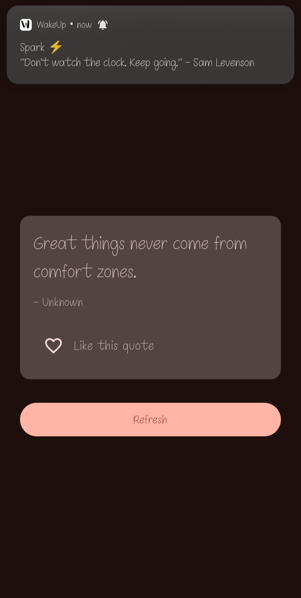
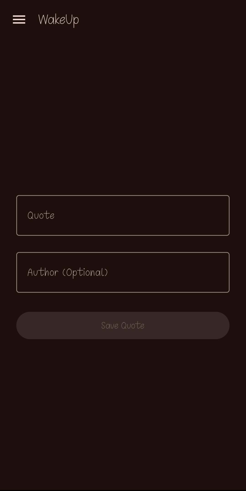
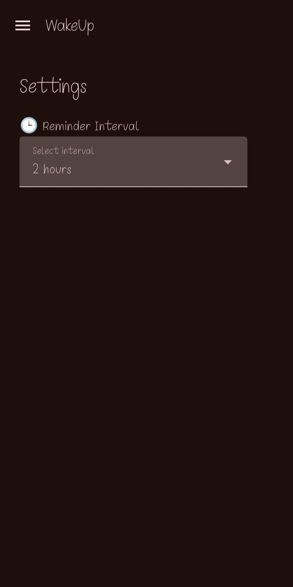

# 🌟 WakeUp - Motivational Quote App

WakeUp is a modern Android app built using Kotlin and Jetpack Compose that delivers motivational quotes via notifications — right when you unlock your phone! 💡✨

---

## 🚀 Features

- 🔔 **Wake-up Notifications** with motivational quotes
- ✍️ **Write Your Own Quote**
- 📂 **Room Database** for storing and retrieving quotes
- 📱 **Jetpack Compose UI** with Material 3 design
- ☁️ **Firebase Integration** for syncing user quotes and likes (Coming Soon)
- ⚙️ **Settings & Custom Preferences**
- 📅 **Scheduled Background Work** using WorkManager

---

## 📸 Screenshots

| Home Screen | Add Quote | Settings |
|-------------|-----------|----------|
|  |  |  |

---

## 🔗 APK Download

📥 [Click here to download APK from Google Drive](https://drive.google.com/file/d/1GJceCYdxG1FBMDEn-exODKC8IW-HLXVv/view?usp=sharing)

---

## 🛠 Tech Stack

- **Kotlin**
- **Jetpack Compose**
- **Room DB**
- **WorkManager**
- **Broadcast Receivers**
- **Firebase Firestore & Storage**

---

## 📁 Project Structure

WakeUp/
├── MainActivity.kt
├── DrawerLayout.kt
├── MainScreen.kt
├── WriteQuoteScreen.kt
├── SettingsScreen.kt
├── WakeUpReceiver.kt
├── data/
│ ├── Quote.kt
│ ├── QuoteDao.kt
│ └── QuoteDatabase.kt
├── viewmodel/
│ ├── QuoteViewModel.kt
│ └── ViewModelFactory.kt
└── utils/
└── PreferenceHelper.kt

---

## 👨‍💻 Developed By

**Arpit Mishra**  
📧 [arpittmishraa@gmail.com](mailto:arpittmishraa@gmail.com)  
🔗 [GitHub Profile](https://github.com/M1ARPIT)

---

## ⭐ Don't forget to star the repo if you liked it!
